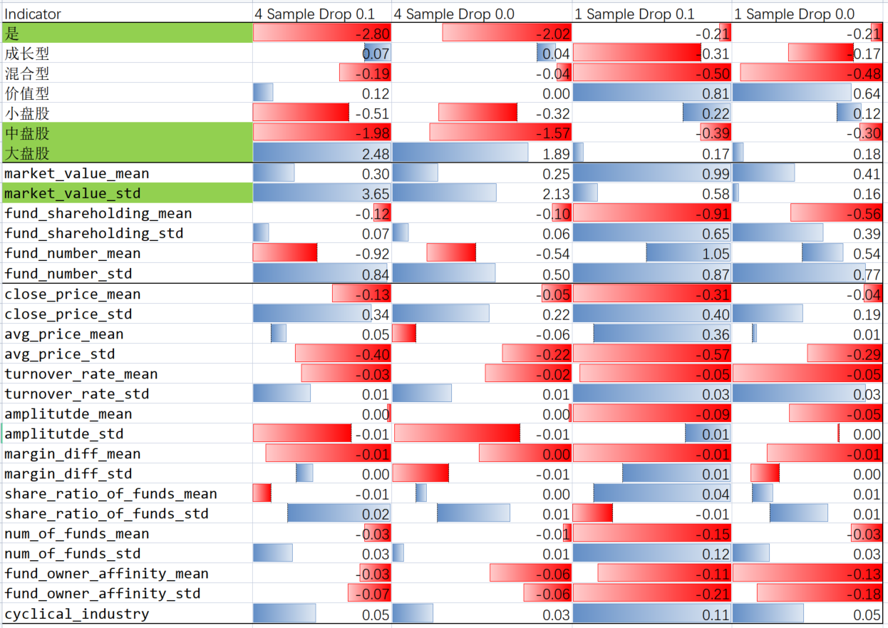

# Linear Analysis

## Linear Result
Name|Training Sample|Training Period|Quarter of raw data in each sample|Training Drop point|Training Label|Test Indicator Sample|Test Indicator Period|Test Label|Test Drop Point|Result Dir|Train Test Shape|Training Sample.1|Month 2 Result|link
-|-|-|-|-|-|-|-|-|-|-|-|-|-|-|
4 Sample Drop 0.1|4|'2020-09-30' '2020-12-31' '2021-03-31' '2021-06-30' |4|0.1|2021-07, 2021-08, 2021-09|1|2020-12-31' '2021-03-31' '2021-06-30' '2021-09-30' |2021-10, 2021-11|0.15|Joyan_4_Sample_Drop_0.1|x_train.shape:(833, 30) x_test.shape:(841, 30) y_train.shape:(833,) y_test.shape:(841,)|833|TP:435, FP:397, TN:0, FN:0|[link](https://github.com/jiachengpan/goldenspoon/tree/master/linear_regression/regress_result/Joyan_4_Sample_Drop_0.1)|
4 Sample Drop 0.0|4|2020-09-30' '2020-12-31' '2021-03-31' '2021-06-30' |4|0.0|2021-07, 2021-08, 2021-09|1|2020-12-31' '2021-03-31' '2021-06-30' '2021-09-30' |2021-10, 2021-11|0.15|Joyan_4_Sample_Drop_0.0|x_train.shape:(1743, 30) x_test.shape:(841, 30) y_train.shape:(1743,) y_test.shape:(841,)|1743|TP:352, FP:286, TN:0, FN:0|[link](https://github.com/jiachengpan/goldenspoon/tree/master/linear_regression/regress_result/Joyan_4_Sample_Drop_0.0)|
1 Sample Drop 0.1|1|2021-06-30' |4|0.1|2021-07, 2021-08, 2021-09|1|2020-12-31' '2021-03-31' '2021-06-30' '2021-09-30' |2021-10, 2021-11|0.15|Joyan_1_Sample_Drop_0.1|x_train.shape:(356, 30) x_test.shape:(841, 30) y_train.shape:(356,) y_test.shape:(841,)|356|TP:16, FP:41, TN:186, FN:320|[link](https://github.com/jiachengpan/goldenspoon/tree/master/linear_regression/regress_result/Joyan_1_Sample_Drop_0.1)|
1 Sample Drop 0.0|1|2021-06-30' |4|0.0|2021-07, 2021-08, 2021-09|1|2020-12-31' '2021-03-31' '2021-06-30' '2021-09-30' |2021-10, 2021-11|0.15|Joyan_1_Sample_Drop_0.0|x_train.shape:(588, 30) x_test.shape:(841, 30) y_train.shape:(588,) y_test.shape:(841,)|588|TP:5, FP:27, TN:127, FN:227|[link](https://github.com/jiachengpan/goldenspoon/tree/master/linear_regression/regress_result/Joyan_1_Sample_Drop_0.0)|

## Linear Weight

